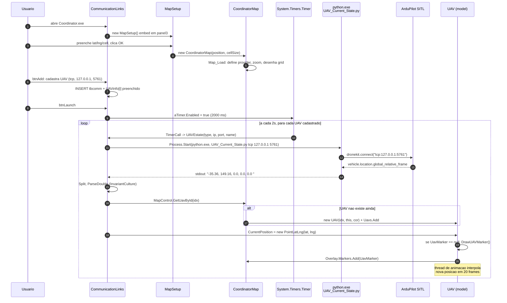

# Sistema de Coordenação Automática de UAVs

Projeto final da minha graduação em Engenharia Elétrica.

Você pode ler mais sobre o projeto em http://sistemabu.udesc.br/pergamumweb/vinculos/000071/0000714c.pdf

Os resultados finais estão disponíveis nos links abaixo:

Link 1: https://www.youtube.com/watch?v=3Yqzs0xaH-0

Link 2: https://www.youtube.com/watch?v=66XQXxAwzAA

# Arquitetura — UAV Coordinator

Documento que descreve **os componentes** da aplicação, **como cada um se liga aos outros** e **o caminho que um dado de telemetria percorre** desde o veículo simulado até o ícone no mapa.

---

## 1. Visão geral

O **UAV Coordinator** é uma aplicação **Windows Forms (.NET Framework 4.8)** cujo objetivo é receber, visualizar e enviar comandos para uma ou mais aeronaves (reais ou simuladas via SITL). Ele **não fala MAVLink diretamente** — em vez disso, **dispara scripts Python (DroneKit)** como subprocessos e usa o `stdout` desses scripts como canal de telemetria. Isso significa que três tecnologias rodam lado a lado:

| Camada | Tecnologia | Responsabilidade |
|---|---|---|
| Interface gráfica | C# / WinForms (.NET Framework 4.8) | Formulários, botões, lista de UAVs, mapa |
| Persistência | SQLite (`CommunicationLinks.db`) | Cadastro de UAVs (nome, IP, porta, tipo) |
| Mapa | GMap.NET 1.9.2 | Renderiza tile do Google Satélite + marcadores |
| Telemetria / controle | Python 2.7 + DroneKit + pymavlink | Conecta ao veículo, lê estado, envia missões |
| Veículo | ArduPilot SITL (em VM Lubuntu) | Simula o ArduCopter via TCP/UDP |

O ponto importante: **C# nunca abre socket MAVLink**. Ele faz `Process.Start(python.exe, script.py …)`, lê linhas do `stdout`, e atualiza a UI a partir desses dados.

---

## 2. Diagrama de componentes

```mermaid
flowchart TB
    subgraph WIN[Windows host]
        subgraph COORD[Coordinator.exe - .NET 4.8 WinForms]
            CL[CommunicationLinks Form<br/>lista de UAVs, botoes Launch/Connect/etc]
            CTL[Control.cs<br/>Fly_UAV, Pause, Resume, RTH]
            LOG[Logger.cs<br/>Log/CommunicationLinks.log]
            DB[(SQLite<br/>CommunicationLinks.db)]
        end

        subgraph MAP[Map.dll - referenciado pelo Coordinator]
            MS[MapSetup Form<br/>lat/lng iniciais + cell size]
            CM[CoordinatorMap Form<br/>GMap + grid + UAVs]
            UAV[UAV.cs<br/>marker + waypoints + trail]
            GRID[GridHandler / Cell<br/>grid logico de celulas]
        end

        subgraph PY[Scripts Python 2.7 - bin/Debug/*.py]
            UCS[UAV_Current_State.py<br/>poll de telemetria]
            SAT[script-arm-takeoff-and-auto.py]
            UPM[upload-mission.py]
            AC[AutoCoord.py]
            PM[PauseMission.py]
            RM[ResumeMission.py]
            RTH[ReturnToHome.py]
        end

        CL -- CRUD --> DB
        CL -- Process.Start --> UCS
        CL -- Process.Start --> SAT
        CL -- Process.Start --> UPM
        CL -- Process.Start --> AC
        CL -- Process.Start --> PM
        CL -- Process.Start --> RM
        CL -- Process.Start --> RTH
        CTL -- Process.Start --> SAT
        UCS -- stdout: "lat, lng, alt, gs, hdg" --> CL
        CL -- "UAV.CurrentPosition = ..." --> UAV
        CL -- "MapControl.GetUavById()" --> CM
        UAV -- desenha marker --> CM
        GRID -- celulas/waypoints --> CM
        CL -- panel3.Controls.Add --> MS
        MS -- new CoordinatorMap --> CM
    end

    subgraph VM[VM Lubuntu]
        SITL[ArduPilot SITL<br/>sim_vehicle.py -v ArduCopter<br/>--out=tcpin:0.0.0.0:5761]
    end

    PY <-- "DroneKit/pymavlink<br/>tcp:IP:5761" --> SITL
```

Versão ASCII (caso o renderizador do mermaid não esteja disponível):

```
+--------------------------- Coordinator.exe (.NET 4.8) ---------------------------+
|                                                                                  |
|   +--------------------------+      +--------------------------------+           |
|   |  CommunicationLinks Form |----->|  SQLite CommunicationLinks.db  |           |
|   |  - lista UAVs            |      +--------------------------------+           |
|   |  - btnConnect/Launch/... |                                                   |
|   |  - aTimer 2s -> Run py   |--+                                                |
|   +-----+--------------------+  |                                                |
|         | embed (panel3)        |                                                |
|         v                       | Process.Start(python.exe, *.py args)           |
|   +-----------+                 |                                                |
|   | MapSetup  |                 |                                                |
|   |   |       |                 v                                                |
|   |   v new   |          +---------------------+   stdout: lat,lng,alt,gs,hdg    |
|   | Coordinato|<---------|  UAV_Current_State  |--+                              |
|   |    rMap   |          |   .py + DroneKit    |  |                              |
|   |  + Grid   |          +---------------------+  |                              |
|   |  + UAV    |          (e demais scripts py)    |                              |
|   +-----------+                 |                 |                              |
+---------------------------------|---------------- | -----------------------------+
                                  | TCP MAVLink     |
                                  v                 |
                            +-------------+         |
                            | SITL na VM  |---------+ (telemetria)
                            | ArduCopter  |
                            +-------------+
```

---

## 3. Estrutura física do projeto

```
UAV-Coordinator/
├── UAVCoordinator.sln          (solucao com dois csprojs)
├── Coordinator/                (projeto WinExe, ponto de entrada)
│   ├── Program.cs              -> Application.Run(new CommunicationLinks())
│   ├── CommunicationLinks.cs   -> form principal (controla tudo)
│   ├── Control.cs              -> orquestra arm/takeoff (parcialmente usado)
│   ├── Logger.cs               -> append text em Log/*.log
│   ├── packages.config         -> EF6, GMap, Newtonsoft, SQLite
│   └── bin/Debug/
│       ├── Coordinator.exe
│       ├── CommunicationLinks.db   (SQLite, tbcomm)
│       ├── *.py                    (DroneKit scripts)
│       └── Cache/mapsetup          (ultima config do mapa)
├── Map/                        (projeto Exe, mas usado como DLL)
│   ├── Program.cs              -> Main vazio (nao roda standalone)
│   ├── MapSetup.cs             -> form de input lat/lng/cell
│   ├── CoordinatorMap.cs       -> form que hospeda o GMapControl
│   ├── UAV/UAV.cs              -> modelo do UAV (posicao, mutex)
│   ├── UAV/Graphics.cs         -> desenha marker + trilha + anima
│   ├── Grid/GridHandler.cs     -> grid de celulas logico
│   ├── Grid/Cell.cs            -> celula contem waypoints
│   ├── Waypoint.cs             -> no de uma lista ligada de wps
│   ├── Utils/Coordinates.cs    -> NewLLPoint, Distance
│   ├── Utils/Geometry.cs       -> DistanceProjection, angulos
│   └── Utils/Parse.cs          -> ParseDouble/Float (InvariantCulture)
└── packages/                   (NuGet packages.config)
```

> Curiosidade: o `Map.csproj` tem `<OutputType>Exe</OutputType>` e um `Program.cs` com `Main` vazio. Na prática o Map é consumido pelo Coordinator via **project reference** ([Coordinator/Coordinator.csproj:116-119](Coordinator/Coordinator.csproj#L116-L119)) e instanciado direto: `new CoordinatorMap.MapSetup()` em [CommunicationLinks.cs:66](Coordinator/CommunicationLinks.cs#L66). O `Map.exe` gerado existe mas é inútil.

---

## 4. Componentes em detalhe

### 4.1 `Coordinator` (entry point)

Form único: `CommunicationLinks` ([Coordinator/CommunicationLinks.cs](Coordinator/CommunicationLinks.cs)).

- **Inicialização** ([linhas 64-76](Coordinator/CommunicationLinks.cs#L64-L76)): cria um `MapSetup`, define `TopLevel=false` e o adiciona a um `Panel` (`panel3`) — ou seja, o mapa é **embedded** dentro do mesmo form. Carrega então `tbcomm` do SQLite na grade.
- **Cadastro de UAVs**: `btnAdd`/`btnEdit`/`btnDelete` ([linhas 264-318](Coordinator/CommunicationLinks.cs#L264-L318)) operam no SQLite via `SQLiteCommand` (montando SQL por concatenação — vulnerável a injection, mas é uso local).
- **Conectar / decolar** (`btnConnect`): roda o script Python selecionado na combobox (`script-arm-takeoff-and-auto.py`, `vehicle_stateC.py` ou `UAV_Current_State.py`).
- **Launch** (`btnLaunch_Click`, [linha 372](Coordinator/CommunicationLinks.cs#L372)): **aqui começa o polling de telemetria.** Inicia um `System.Timers.Timer` de **2000 ms** que, a cada tick, percorre todos os UAVs cadastrados e chama `UAVEstate()` para cada um.
- **`UAVEstate(...)`** ([linha 399](Coordinator/CommunicationLinks.cs#L399)): roda `UAV_Current_State.py <type> <ip> <port>`, lê `stdout`, faz `Split` por `", "` e atualiza:
  - `UAVinfo[i].Lat/Lon/Alt/Groundspeed/Heading` (struct interno)
  - `map.MapControl.GetUavById(i).CurrentPosition = new PointLatLng(lat, lng)` — **isso é o que move/cria o ícone no mapa**
  - Textboxes da UI (`UpdatingTextBoxLatitude`, etc., usando `Invoke` para cross-thread)
- **Missões** (`btnLoadMission`, `btnUpload`): carrega arquivo `.txt` no formato QGC WPL 110 (`MissionList`), envia ao veículo via `upload-mission.py`, e chama `map.MapControl.MissionChanged()` para desenhar os waypoints na tela.
- **AutoCoord**: o `btnStartMission_Click` ([linha 702](Coordinator/CommunicationLinks.cs#L702)) executa `AutoCoord.py`, que é uma máquina de estados (`UPDATINGMISSION → TAKEOFF → MISSION → END`) que pega a missão carregada no veículo, decola, voa e retorna.

### 4.2 `Map` (biblioteca de visualização)

Cada classe tem um papel bem específico:

| Arquivo | Papel |
|---|---|
| [Map/MapSetup.cs](Map/MapSetup.cs) | Form que pede 4 valores (lat inicial, lng inicial, largura/altura de célula em metros). No clique do botão, instancia `CoordinatorMap` e o adiciona como filho. Cacheia entradas em `Cache/mapsetup`. |
| [Map/CoordinatorMap.cs](Map/CoordinatorMap.cs) | Form que hospeda o `GMapControl`. Define provider (Google Satellite), posiciona o mapa, calcula proporção metro/pixel para 5 níveis de zoom, e desenha o grid inicial. Mantém a `List<UAV> Uavs`, mutexes, e a paleta de cores. Inicia a thread de animação. |
| [Map/UAV/UAV.cs](Map/UAV/UAV.cs) | Modelo de cada UAV. `CurrentPosition` é uma **propriedade com mutex**: ao setar, dispara `DrawUAVMarker()` se ainda não existe marker. |
| [Map/UAV/Graphics.cs](Map/UAV/Graphics.cs) | Desenha o ícone (bitmap 46×50 com forma de avião), rotaciona conforme o `heading`, desenha trilha (`TrailLines`) e marcadores dos waypoints. Mantém uma **thread de animação** que interpola o movimento entre duas posições (`FramesNum = 20`, `FrameDelay = 20ms`) — por isso o UAV "desliza" entre posições em vez de saltar. |
| [Map/Grid/GridHandler.cs](Map/Grid/GridHandler.cs) e [Cell.cs](Map/Grid/Cell.cs) | Estrutura de grid lógico: lista ordenada de latitudes, cada uma com lista ordenada de longitudes. Cada célula guarda os waypoints que caem dentro dela. Usado para detecção de proximidade entre waypoints de UAVs diferentes (lógica de coordenação). |
| [Map/Waypoint.cs](Map/Waypoint.cs) | Nó de lista ligada: `Prev`/`Next` apontam para waypoints adjacentes da missão, e `Cell` aponta para a célula do grid. |
| [Map/Utils/*.cs](Map/Utils/) | Helpers: `NewLLPoint` (deslocar um ponto em metros), `Distance`, `DistanceProjection` (achar ponto da linha p1-p2 mais próximo de `current`), `MovementAngularVariation` (calcular rotação do ícone), e `ParseDouble` com `InvariantCulture`. |

### 4.3 Scripts Python (DroneKit)

Todos seguem o mesmo padrão de argumentos: `<tipo> <ip> <porta>` (e às vezes `<mission_path>`). Montam a `connection_string` como `"tcp:127.0.0.1:5761"` e chamam `dronekit.connect(...)`.

| Script | Disparado por | O que faz |
|---|---|---|
| `UAV_Current_State.py` | Timer de 2s ([CommunicationLinks.cs:403](Coordinator/CommunicationLinks.cs#L403)) | Conecta, lê `vehicle.location.global_relative_frame`, imprime `"lat, lng, alt, gs, hdg "` no `stdout`, fecha. **Não loopa** — uma execução = um ponto. |
| `script-arm-takeoff-and-auto.py` | `btnConnect` / `Control.Fly_UAV` | Arma em GUIDED, decola para 10m, troca para AUTO, fecha. |
| `upload-mission.py` | `btnUpload` | Lê arquivo no formato QGC WPL 110, monta lista de `Command` e faz upload via `vehicle.commands`. |
| `AutoCoord.py` | `btnStartMission` | Máquina de estados (UPDATINGMISSION → TAKEOFF → MISSION → END). Faz takeoff, voa missão, executa rotina de delivery, RTL. |
| `PauseMission.py` | `btnPause` | Loiter / pausa a execução da missão. |
| `ResumeMission.py` | `btnResume` | Retoma missão em AUTO. |
| `ReturnToHome.py` | `btnReturn` | Coloca em RTL. |
| `vehicle_stateC.py`, `helloC.py` | combobox `cbxScript` (debug manual) | Exemplos didáticos do DroneKit. |

### 4.4 Persistência

- **SQLite** `CommunicationLinks.db` (em `Coordinator/bin/Debug/`), tabela `tbcomm(ConnectionName, Type, IPAddress, Port)`. Acessada via `System.Data.SQLite` (legado, mas funcional). Nada de Entity Framework apesar de o pacote estar referenciado.
- **`Cache/mapsetup`**: arquivo texto com a última configuração do mapa (lat, lng, dx, dy). Restaurado em `MapSetup` ao abrir, então o usuário não precisa reconfigurar a cada execução.
- **`Log/CommunicationLinks.log`**: append-only, escrito pela classe `Logger` quando ocorre `FormatException` no parsing do `stdout` do Python.
- **`Missions/*.txt`**: arquivos de missão no formato QGC WPL 110. Podem chegar:
  - Localmente, via `btnLoadMission` + `OpenFileDialog`.
  - Por **socket TCP** de uma GCS remota (`ReceivingMissions`, [linha 651](Coordinator/CommunicationLinks.cs#L651)) — **ATUALMENTE DESLIGADO**: o bloco que faz `listenerSocket.Bind` + `Accept` está comentado em [Connection_Handler](Coordinator/CommunicationLinks.cs#L625-L649).

---

## 5. Fluxo: "como uma aeronave aparece no mapa"

Sequência completa, do clique do usuário até o pino na tela:



### Pontos-chave do fluxo

1. **Não há setup automático do mapa**: se o usuário pular a tela de `MapSetup` e clicar direto em `btnLaunch`, `map.MapControl` é `null` e o passo `MapControl.GetUavById(...)` lança `NullReferenceException`. Como o `try/catch` em [linha 452](Coordinator/CommunicationLinks.cs#L452) só captura `FormatException`, **a thread do timer morre silenciosamente** — a UI fica como se nada estivesse acontecendo.

2. **Janela do mapa precisa cobrir as coordenadas do SITL**: o SITL spawnsa por padrão em Canberra (`-35.363, 149.165`). Se o `MapSetup` foi configurado com lat/lng do Brasil, o marker **é criado** mas fica fora da viewport. Soluções: configurar mapa em Canberra, ou usar `sim_vehicle.py --custom-location=<lat>,<lng>,<alt>,<heading>`.

3. **Antes do GPS lock**, `vehicle.location.global_relative_frame.lat` é `None`. O Python imprime `"None, None, ..."` e `ParseDouble("None")` lança `FormatException` capturada → linha é logada como `"Invalid coordinates: None, ..."` em `Log/CommunicationLinks.log` e o ciclo recomeça.

4. **Polling é caro**: cada tick do timer roda **um processo Python novo por UAV**. Em duas máquinas há (no mínimo) 2 `python.exe` por segundo. DroneKit também leva 1-2s só para handshake. Por isso o intervalo é 2000 ms — abaixo disso há sobreposição.

5. **Dependências obrigatórias na máquina onde roda o Coordinator**:
   - Python 2.7 em `C:\Python27\python.exe` (caminho hardcoded em vários lugares de [CommunicationLinks.cs](Coordinator/CommunicationLinks.cs) e [Control.cs](Coordinator/Control.cs)).
   - Pacotes Python: `dronekit`, `pymavlink`.
   - Acesso de rede ao IP/porta do SITL.

---

## 6. Onde o protocolo de comunicação é "frágil"

Pontos da arquitetura que merecem atenção em uma futura evolução:

- **Telemetria via stdout**: o "protocolo" entre C# e Python é uma string `"lat, lng, alt, gs, hdg "`. Qualquer alteração de formato (espaço a mais, `print` extra, etc.) quebra silenciosamente o parse.
- **Caminho do Python hardcoded**: `C:\Python27\python.exe` aparece literal em 7+ lugares. Em uma máquina sem essa pasta exata, nada funciona.
- **Erros não-FormatException quebram a thread**: o `try/catch` em `UAVEstate` ([linha 452](Coordinator/CommunicationLinks.cs#L452)) só captura `FormatException`. Qualquer outra exceção (e.g. `IndexOutOfRangeException`, `NullReferenceException`) encerra a thread do tick sem aviso na UI.
- **Sem stderr**: o `ProcessStartInfo` redireciona apenas `StandardOutput`. Se o script Python falha (import error, conexão recusada, etc.), o `stderr` vai para o vazio.
- **Listener TCP de missões desligado**: o bloco em `Connection_Handler` está comentado, então `Map → Coordinator` por rede não funciona hoje, apesar do código de `ReceivingMissions` existir.
- **SQL por concatenação**: usuário local, baixo risco, mas vale notar.

---

## 7. Pré-requisitos para rodar (Windows)

1. **.NET Framework 4.8 runtime** instalado.
2. **Python 2.7** em `C:\Python27\` (caminho hardcoded).
3. Pacotes Python: `pip install dronekit pymavlink` (Python 2.7 já não é suportado por pip moderno — usar wheels antigos ou `get-pip.py` legado).
4. **SITL** (em VM ou local) acessível por TCP/UDP. Exemplo:
   ```
   sim_vehicle.py -v ArduCopter --console --norebuild --out=tcpin:0.0.0.0:5761
   ```
5. No Coordinator:
   - Cadastrar UAV com `Type=tcp`, `IPAddress=<ip da VM>`, `Port=5761`.
   - Clicar no botão do **MapSetup** e configurar lat/lng **próximos da posição do SITL**.
   - Clicar em **Launch** para iniciar o ciclo de telemetria de 2 em 2 segundos.

---

## 8. Resumo em uma frase

> O Coordinator é um **front WinForms** que **delega toda a comunicação MAVLink a scripts Python DroneKit** rodados como subprocessos, e usa a `stdout` desses scripts como **canal de telemetria** para alimentar o componente de mapa GMap.NET.

---
